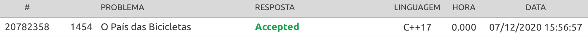
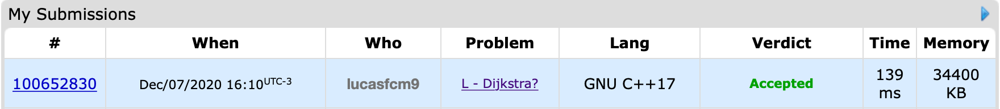

# URI/CodeForces

**Conteúdo da Disciplina**: Trabalho Final<br>

## Alunos
|Matrícula | Aluno |
| -- | -- |
| 16/0133394  |  Lucas Fellipe C. Moreira |

## Sobre 
O projeto consiste na resolução de dois problemas, um do URI e outro do CodeForces. O problema do URI se chama [O País das Bicicletas](https://www.urionlinejudge.com.br/judge/pt/problems/view/1454) e o do CodeForces se chama [Dijkstra?](https://codeforces.com/problemset/problem/20/C). A solução dos dois problemas é realizada utilizando Grafos e Programação Dinâmica. 

O primeiro problema (O País das Bicicletas) foi resolvido utilizando o Algoritmo de <i>Floyd Warshall</i> e o segundo problema (Dijkstra?) foi resolvido utilizando o Algoritmo de <i>Dijkstra</i>.

## Screenshots




## Instalação 
**Linguagem**: C++17<br>

## Uso 
Para usar, clone o repositório ```git clone https://github.com/projeto-de-algoritmos/Final_Lucas.git```, acesse a pasta ```dijkstra``` e digite ```g++ sol.cpp -std=c++17 -o sol``` e, logo em seguida, digite ```./sol < in1```. Caso queira rodar o problema do CodeForces. Caso queira rodar o problema do URI, basta entrar na pasta ```o-país-das-bicicletas``` e digitar ```g++ sol.cpp -std=c++17 -o sol``` e, logo em seguida, digite ``./sol < in1```. Nas duas pastas temos os inputs dos exercícios resolvidos.


