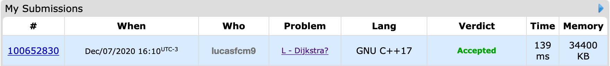

# [Dijkstra?](https://codeforces.com/problemset/problem/20/C)

## Veredito do Código



## Respostas

Gabarito dos inputs fornecidos

### [Input 01](in1)

Caso de teste retirado da própria questão

```
1 4 3 5
```

### [Input 02](in2)
Caso de teste retirado da própria questão

```
1 4 3 5
```
